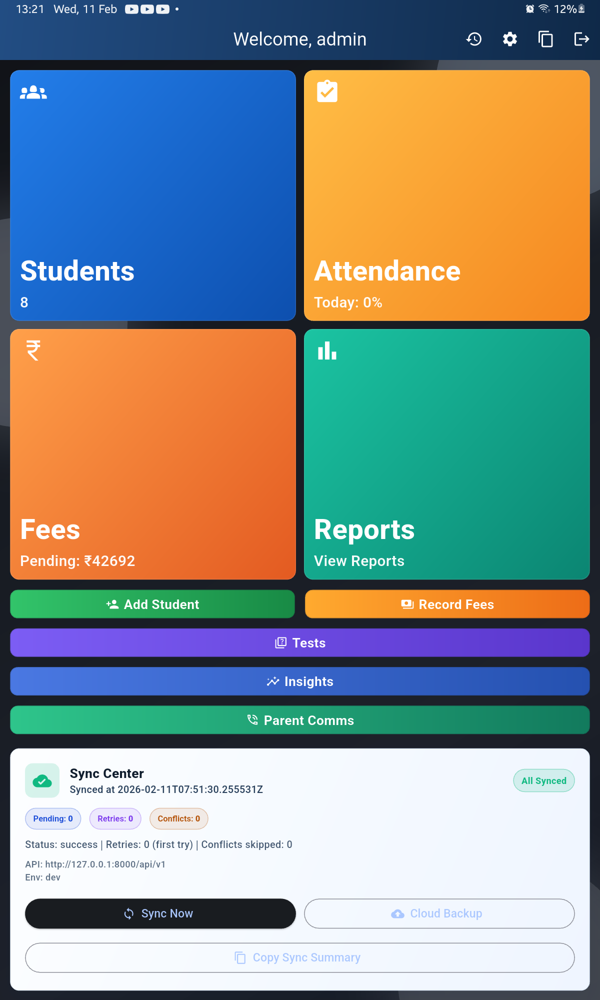
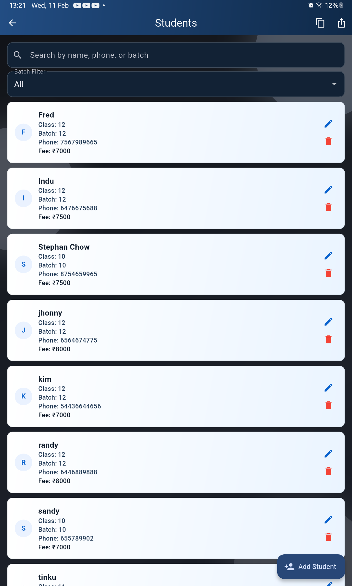
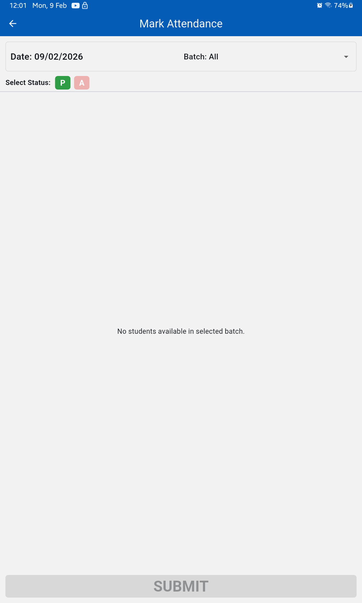
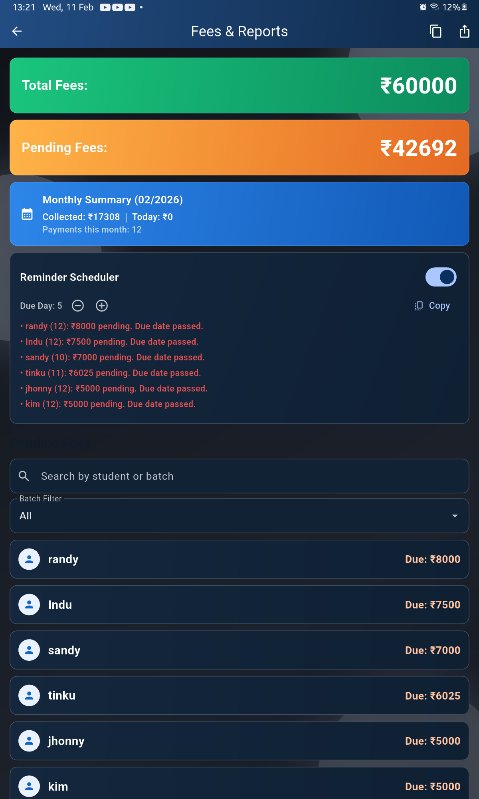
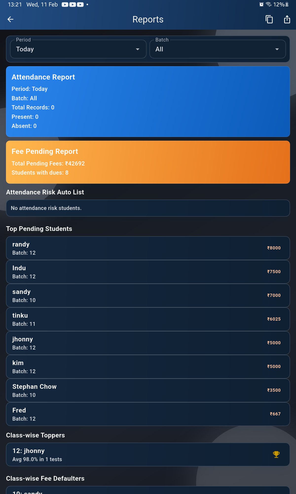
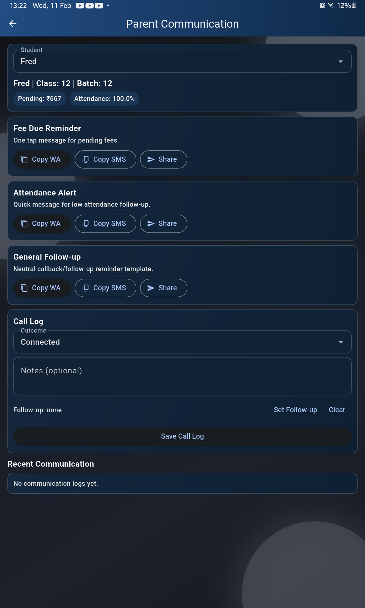
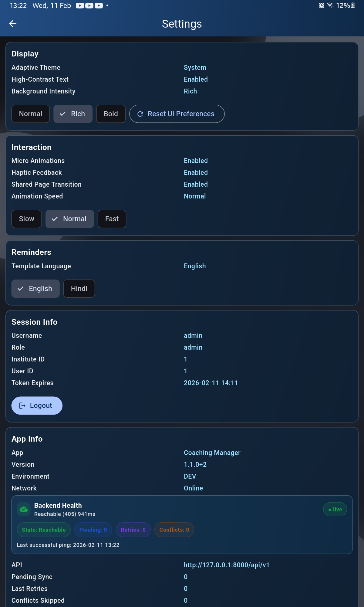
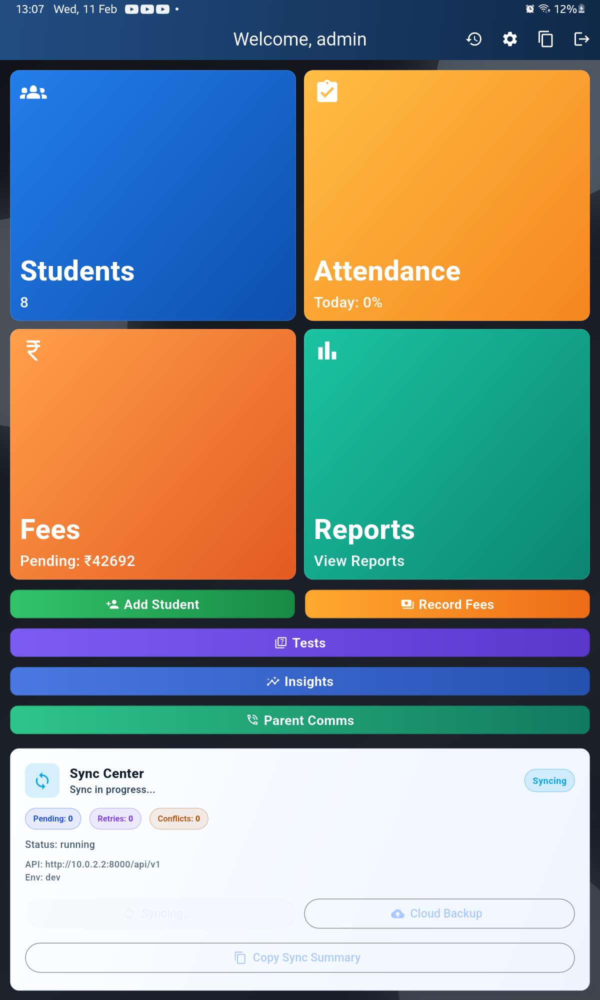
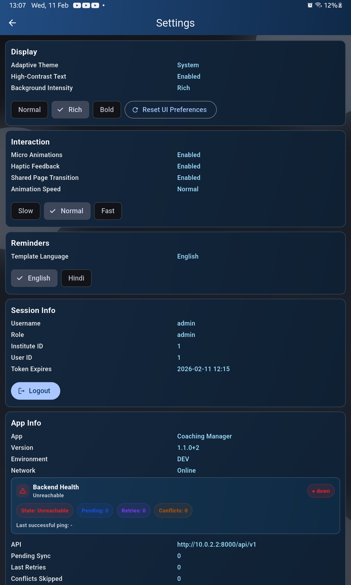

# Coaching Manager (Showcase)

A coaching institute management app built with an offline-first Android experience and a hosted backend. Coaching Manager is designed to help institutes manage students, attendance, fees, tests, reports, and day-to-day academic workflows without depending on constant internet connectivity.

## At A Glance

- Product: Offline-first coaching institute management app
- Platform: Android mobile app with hosted backend
- Focus Areas: Students, attendance, fees, tests, reports, sync
- Stack: Flutter, Django REST Framework, PostgreSQL

## Demo

- Video walkthrough: [Google Drive Demo](https://drive.google.com/file/d/1790s_KiDSGpwOiHegeOK5FZvWhd9ZZe4/view?usp=drive_link)
- Showcase video asset: [coaching-manager-showcase-polished.mp4](./video/coaching-manager-showcase-polished.mp4)

## Overview

Coaching Manager is a mobile-first institute operations app built for real usage scenarios where network connectivity may be inconsistent. Users can work with local data on-device and sync changes back to the server when connectivity is available. This makes the app practical for institutes that need reliability, speed, and a simple operational workflow on Android devices.

## Key Features

- Student management with profiles, class and batch mapping, and quick insights
- Attendance workflow with daily marking, reporting, and risk tracking
- Fee management with pending dues tracking, payment entry flow, and reminders
- Test management with test creation, marks entry, and performance trend tracking
- Reporting tools with CSV and TXT exports plus summary views
- Offline-first local storage with push/pull synchronization to the backend
- Secure institute-scoped backend access with JWT-based authentication

## Tech Stack

- Mobile: Flutter, Dart, Provider, `sqflite`
- Backend: Python, Django, Django REST Framework, JWT authentication
- Database: PostgreSQL
- Hosting: Render

## Architecture

- Flutter Android app for the primary mobile experience
- Local SQLite storage for offline-first workflows
- Django REST API for authentication, data access, and sync operations
- Push/pull synchronization between device and backend
- PostgreSQL for persistent server-side institute data

For a short architecture breakdown, see [ARCHITECTURE.md](./ARCHITECTURE.md).

## Screenshots

### Dashboard

### Students

### Attendance

### Fees

### Reports

### Parent Communication

### Settings

### Sync Dashboard

### Sync Settings

## Use Cases

- Manage student records and class assignments
- Track attendance and identify at-risk students
- Monitor fee status and record payments
- Enter test marks and review academic performance trends
- Export reports for administrative workflows

## Repository Scope

This repository is a public showcase only. It is meant for portfolio, recruiter, and client review, while the production codebase and sensitive assets remain private.

- No source code
- No APK
- No secrets or environment files

## Portfolio Note

This showcase is intended to communicate product thinking, feature scope, architecture, and user flow at a glance. For implementation-sensitive details, the repository stays intentionally high-level.
